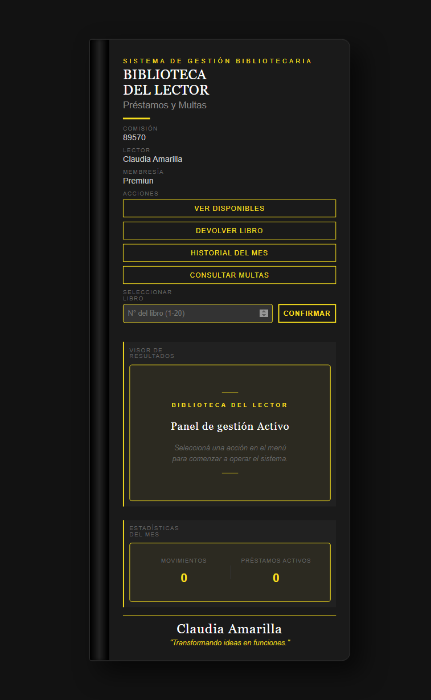

# Biblioteca del Lector

## Descripción
Este proyecto consiste en una pequeña aplicación desarrollada en JavaScript que simula el funcionamiento básico de una biblioteca. El sistema permite visualizar libros disponibles, registrar préstamos, realizar devoluciones y consultar el historial de movimientos junto con posibles multas por retraso.

La idea principal fue crear un sistema sencillo que permita gestionar ejemplares de una biblioteca desde una interfaz clara y fácil de utilizar.

## Funcionalidades
El sistema permite realizar las siguientes acciones:

- Visualizar el catálogo de libros disponibles para préstamo.
- Registrar el retiro de un libro.
- Devolver un libro previamente prestado.
- Consultar el historial de movimientos del sistema.
- Ver posibles multas generadas por retrasos en la devolución.
- Mostrar estadísticas generales de actividad.

Cada préstamo tiene una duración de 14 días. Si el libro no es devuelto dentro de ese período, el sistema calcula automáticamente una multa diaria equivalente al 5% del valor del libro.

## Tecnologías utilizadas
El proyecto fue desarrollado utilizando:

- **HTML** para la estructura del sitio.
- **CSS** para el diseño visual de la interfaz.
- **JavaScript** para la lógica del sistema.
- **LocalStorage** para almacenar los datos de los préstamos.
- **JSON** para definir el catálogo inicial de libros.

## Cómo probar el proyecto
1. Cloná el repositorio
2. Abrí `index.html` en tu navegador
3. Usá los botones del panel para interactuar con el sistema

## Funcionamiento del sistema
Al iniciar la aplicación se muestra un panel de bienvenida desde donde se pueden ejecutar las diferentes acciones del sistema.

El catálogo de libros se carga desde un archivo JSON y se convierte en objetos dentro de JavaScript. A partir de allí el sistema permite gestionar los préstamos y devoluciones.

Los datos generados durante el uso del sistema se guardan en LocalStorage, lo que permite mantener la información incluso si la página se recarga.

## Objetivo del proyecto
El objetivo de este trabajo fue aplicar distintos conceptos de JavaScript aprendidos durante el curso, tales como:

- Funciones constructoras
- Manejo de arrays y métodos como map, filter y find
- Manipulación del DOM
- Manejo de eventos
- Uso de LocalStorage para persistencia de datos
- Cálculo de fechas para gestionar vencimientos y multas

## Autora
**Claudia Amarilla**  
Proyecto realizado como práctica de JavaScript para Coderhouse.

## Vista completa del proyecto

